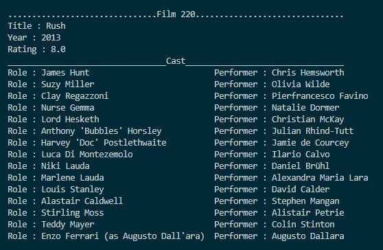

# IMDB TOP 250 MOVIES

    This is a simple web scrapping project. It scrapes data from IMDB website. Then, it can print data properly on console or it can export data as a JSON file.

    >> Movies did not place sorted in the dictionary!

## Instructions

    Please install BeautifulSoup module before running the script.
    - pip install beautifulsoup4

## Output

